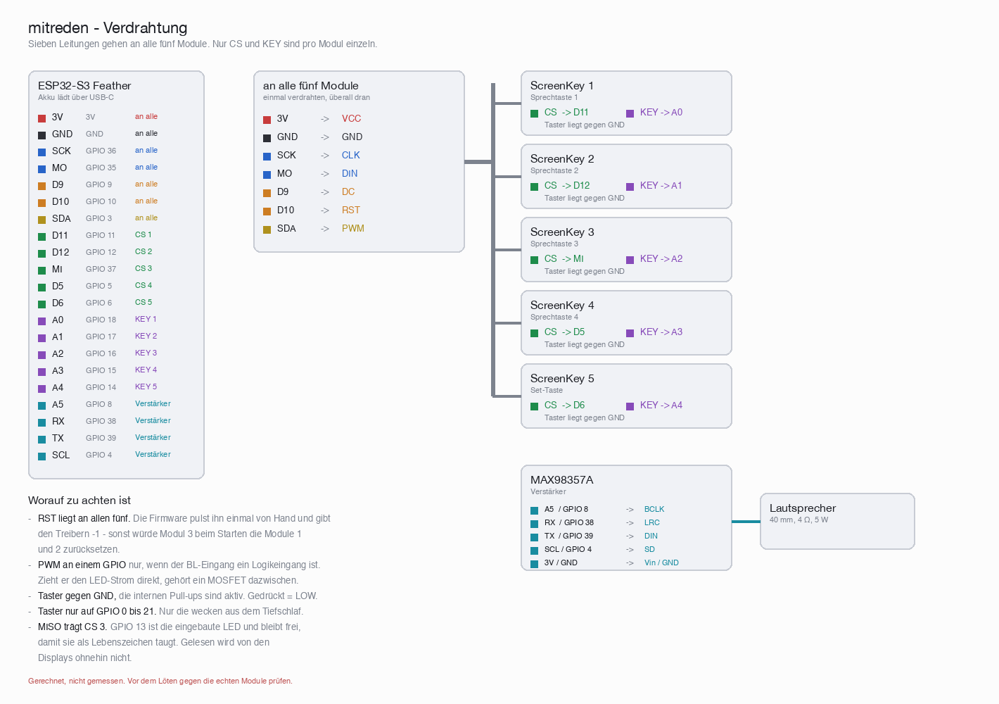

# Hardware: Bauteile, Verdrahtung, Gehäuse

## Bauteile

| Teil | Anzahl | Bezugsquelle | Einzelpreis |
|------|-------:|--------------|------------:|
| Adafruit ESP32-S3 Feather, 8 MB Flash, ohne PSRAM | 1 | [Eckstein](https://eckstein-shop.de/Adafruit-ESP32-S3-Feather-8MB-Flash-No-PSRAM-with-STEMMA-QT-Qwiic) | 24,95 € |
| Waveshare ScreenKey, 0,85" IPS, 128×128, ST7735 | 5 | [BerryBase](https://www.berrybase.de/waveshare-screenkey-lcd-modul-0-85-zoll-ips-display-128-x-128-pixel-st7735-schwarz-3-3v/version-vollstaendiger-screenkey) | |
| Adafruit MAX98357A, I2S 3W Class-D | 1 | [Eckstein](https://eckstein-shop.de/AdafruitI2S3WClassDAmplifierBreakout-MAX98357A) | 7,95 € |
| Lautsprecher 40 mm, 4 Ω, 5 W | 1 | [Eckstein](https://eckstein-shop.de/40mm-15-Internal-Magnetic-4Ohm-5W-Bass-Multimedia-Speaker) | 3,95 € |
| LiPo 3,7 V 2500 mAh, JST-PHR-2, 63 × 50,3 × 8,1 mm, 52 g | 1 | [Eckstein](https://eckstein-shop.de/LiPo-Akku-Lithium-Ion-Polymer-Batterie-37V-2500mAh-mit-JST-PHR-2-Stecker-LP785060) | 9,95 € |

Preise Stand August 2026, ohne Gehäuse. Beim ScreenKey die Ausführung
**"vollständiger ScreenKey"** wählen — es gibt das Modul auch ohne den
Tastenmechanismus, und der ist hier der halbe Sinn: Display und Taster in
einem.

**Der Feather ist nicht beliebig austauschbar.** Zwei Dinge hängen an ihm:

- Er lädt den LiPo über USB-C und hat den passenden JST-PH-Anschluss dafür.
  Deshalb braucht das Gerät weder Ladebuchse noch Schalter. Ein Board ohne
  Ladeschaltung - etwa im Arduino-Nano-Format - braucht zusätzlich ein
  Lademodul.
- Die gesamte Pinbelegung unten ist auf ihn zugeschnitten, besonders die
  Taster: sie müssen auf GPIO 0 bis 21 liegen, sonst wecken sie den Chip
  nicht aus dem Tiefschlaf.

Bewusst nicht vorgesehen: Lautstärkeregler und Ein-/Aus-Schalter. Das Gerät
schläft von selbst ein und wacht auf Tastendruck auf; die Lautstärke regelt
die Normalisierung beim Bauen.

## Verdrahtung



Gezeichnet von `tools/verdrahtung.py` aus der Belegung unten — wenn sich an
den echten Modulen etwas als anders herausstellt, dort ändern und das Skript
neu laufen lassen:

```bash
python3 tools/verdrahtung.py
```

## Pinbelegung (Vorschlag)

| Funktion                | GPIO | Beschriftung auf dem Feather |
|-------------------------|-----:|------------------------------|
| SPI SCK (alle Displays) |   36 | SCK                          |
| SPI MOSI (alle)         |   35 | MO                           |
| Display DC (alle)       |    9 | D9                           |
| Display RST (alle)      |   10 | D10                          |
| Backlight (alle)        |    3 | SDA                          |
| CS Display 1            |   11 | D11                          |
| CS Display 2            |   12 | D12                          |
| CS Display 3            |   13 | D13                          |
| CS Display 4            |    5 | D5                           |
| CS Display 5 (Set)      |    6 | D6                           |
| Taster 1                |   18 | A0                           |
| Taster 2                |   17 | A1                           |
| Taster 3                |   16 | A2                           |
| Taster 4                |   15 | A3                           |
| Taster 5 (Set)          |   14 | A4                           |
| I2S BCLK                |    8 | A5                           |
| I2S LRCLK (WS)          |   38 | RX                           |
| I2S DIN                 |   39 | TX                           |
| MAX98357A SD            |    4 | SCL                          |

Warum genau diese Taster-Pins: aufwecken aus dem Deep Sleep geht beim ESP32-S3
nur über GPIO 0 bis 21. GPIO 14 bis 18 liegen in diesem Bereich und sind auf
dem Feather als A0-A4 sauber herausgeführt.

**Verkabelung:**

- Taster gegen **GND**, die internen Pull-ups sind aktiv. Gedrückt = LOW.
- MISO wird nicht gebraucht, die Displays werden nur beschrieben.
- `SD` am MAX98357A hängt an GPIO 4: der Verstärker ist stumm, außer während
  ein Wort läuft. Das spart Strom und das leise Rauschen im Ruhezustand.
- Das Backlight aller fünf Displays an einem GPIO funktioniert nur, wenn der
  BL-Eingang der Screenkeys ein Logikeingang ist. Zieht er den LED-Strom
  direkt, gehört ein kleiner MOSFET dazwischen - fünf Backlights sind mehr,
  als ein GPIO treiben darf.
- Beim Verlöten die tatsächliche Screenkey-Belegung prüfen; die Tabelle oben
  beschreibt die Seite des Feathers.

Falls das Bild um ein paar Pixel verschoben ist oder ein Rand stehen bleibt:
`PANEL_COL_OFFSET` und `PANEL_ROW_OFFSET` oben im Sketch anpassen.

## Gehäuse

Gemessene Teile: Screenkey-Platine 25,94 x 35,29 mm, Tastenkappe 22,00 x
25,30 mm mit 8,6 mm Überstand, sichtbares Bild nur **15,21 x 15,21 mm**.
Lautsprecher 40,3 x 40,3 x 25,3 mm.

| | Maß |
|---|---|
| Raster der vier Sprechtasten | 37,0 x 45,3 mm |
| Spalt zwischen den Kappen | 15 mm seitlich, 20 mm zwischen den Reihen |
| Abstand Set-Taste zum Viererblock | 25 mm |
| Spalt Lautsprecher zur Set-Taste | 5 mm |
| Bauteile insgesamt | 117 x 81 mm |
| Gehäuse außen | etwa 131 x 95 x 36 mm |

Anordnung: Lautsprecher oben links, darunter die Set-Taste, rechts daneben die
vier Sprechtasten als 2x2-Block. Set-Taste und untere Tastenreihe schließen
unten bündig ab - das geht genau auf, weil Lautsprecher + 5 mm + Set-Platine
zusammen 80,6 mm ergeben und der Block bei diesem Raster ebenfalls 80,6 mm hoch
ist.

**Wichtig:** Die Platinen dürfen sich nicht berühren. Dann blieben seitlich
nur 25,94 - 22,00 = 3,9 mm zwischen den Kappen, und eine Kinderhand träfe zwei
Tasten auf einmal.

### Was hinter die Front passt

Die ScreenKeys brauchen hinter der Frontplatte nur **15,4 mm** (24,0 gesamt
minus 8,6 Kappenüberstand), der Lautsprecher **25,3 mm**. Den Rest bestimmen
Akku und Feather.

Der Akku ist **63 × 50,3 × 8,1 mm**. Hinter den Tastenblock (62,9 × 80,6 mm)
passt er nur **quer gedreht** - längs fehlt ein Zehntelmillimeter. Quer bleiben
seitlich 12,6 mm und oben 17,6 mm frei.

Der Feather ist 22,8 mm breit und passt damit **nicht** in die 12,6 mm neben
den Akku. Er muss darüber, also gestapelt:

```
Taste 15,4  +  Akku 8,1  +  Feather 8,0  =  31,5 mm
Lautsprecher allein:                        25,3 mm
```

Damit bestimmt nicht mehr der Lautsprecher die Tiefe, sondern der Stapel:
**innen etwa 32 mm, außen rund 36 mm.**

Beim Stapeln daran denken, dass die USB-C-Buchse des Feathers eine
Gehäusekante erreichen muss - sonst lässt sich nicht laden.

Der Akku wiegt **52 g** und ist damit das schwerste Einzelteil. Wo er sitzt,
entscheidet, wie sich das Gerät in der Hand anfühlt.

Noch zu prüfen, wenn die Teile da sind: ob die Tastenkappe mittig auf der
Platine sitzt. Auf den Bildern liegen FPC- und Stiftleistenanschluss im unteren
Bereich - falls die Kappe nach oben versetzt ist, verschieben sich alle
Senkrechtmaße und damit die Frontausschnitte.

---
