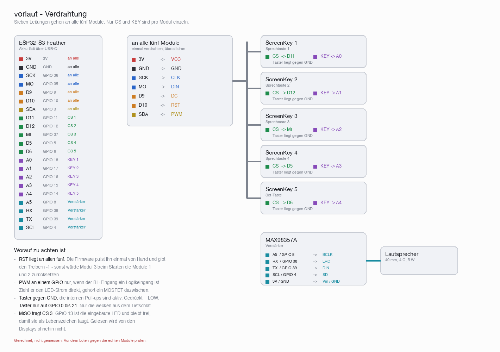

# Hardware: parts, wiring, case

## Parts

| Part | Qty | Source | Unit price |
|------|----:|--------|-----------:|
| Adafruit ESP32-S3 Feather, 8 MB flash, no PSRAM | 1 | [Eckstein](https://eckstein-shop.de/Adafruit-ESP32-S3-Feather-8MB-Flash-No-PSRAM-with-STEMMA-QT-Qwiic) | 24,95 € |
| Waveshare ScreenKey, 0.85" IPS, 128×128, ST7735 | 5 | [BerryBase](https://www.berrybase.de/waveshare-screenkey-lcd-modul-0-85-zoll-ips-display-128-x-128-pixel-st7735-schwarz-3-3v/version-vollstaendiger-screenkey) | |
| Adafruit MAX98357A, I2S 3W class D | 1 | [Eckstein](https://eckstein-shop.de/AdafruitI2S3WClassDAmplifierBreakout-MAX98357A) | 7,95 € |
| Speaker 40 mm, 4 Ω, 5 W | 1 | [Eckstein](https://eckstein-shop.de/40mm-15-Internal-Magnetic-4Ohm-5W-Bass-Multimedia-Speaker) | 3,95 € |
| LiPo 3.7 V 2500 mAh, JST-PHR-2, 63 × 50.3 × 8.1 mm, 52 g | 1 | [Eckstein](https://eckstein-shop.de/LiPo-Akku-Lithium-Ion-Polymer-Batterie-37V-2500mAh-mit-JST-PHR-2-Stecker-LP785060) | 9,95 € |

Prices as of August 2026, case not included. For the ScreenKey, pick the
**"complete ScreenKey"** version — the module also comes without the key
mechanism, and that mechanism is half the point here: display and button in
one.

**The Feather is not freely interchangeable.** Two things depend on it:

- It charges the LiPo over USB-C and has the matching JST-PH connector for it.
  That is why the device needs neither a charging socket nor a switch. A board
  without charging circuitry — an Arduino Nano form factor, say — needs an
  extra charging module.
- The whole pin assignment below is cut to fit it, the buttons in particular:
  they have to sit on GPIO 0 to 21, otherwise they will not wake the chip from
  deep sleep.

Deliberately not provided for: a volume control and an on/off switch. The
device falls asleep by itself and wakes on a key press; the volume is set by
the normalisation during the build.

## Wiring



Drawn by `tools/wiring.py` from the assignment below — if something turns
out differently on the real modules, change it there and run the script again:

```bash
python3 tools/wiring.py
```

## Pin assignment (proposed)

| Function                | GPIO | Label on the Feather |
|-------------------------|-----:|----------------------|
| SPI SCK (all displays)  |   36 | SCK                  |
| SPI MOSI (all)          |   35 | MO                   |
| Display DC (all)        |    9 | D9                   |
| Display RST (all)       |   10 | D10                  |
| Backlight (all)         |    3 | SDA                  |
| CS display 1            |   11 | D11                  |
| CS display 2            |   12 | D12                  |
| CS display 3            |   37 | MI (MISO)            |
| CS display 4            |    5 | D5                   |
| CS display 5 (set)      |    6 | D6                   |
| Button 1                |   18 | A0                   |
| Button 2                |   17 | A1                   |
| Button 3                |   16 | A2                   |
| Button 4                |   15 | A3                   |
| Button 5 (set)          |   14 | A4                   |
| I2S BCLK                |    8 | A5                   |
| I2S LRCLK (WS)          |   38 | RX                   |
| I2S DIN                 |   39 | TX                   |
| MAX98357A SD            |    4 | SCL                  |

Why exactly these button pins: waking from deep sleep on the ESP32-S3 works
through GPIO 0 to 21 only. GPIO 14 to 18 fall inside that range and are cleanly
broken out on the Feather as A0-A4.

**Wiring notes:**

- Buttons against **GND**, the internal pull-ups are active. Pressed = LOW.
- MISO carries CS for display 3. On the Feather, GPIO 13 is the built-in red
  LED and therefore stays free — during first bring-up it is the first sign of
  life. Nothing is read from the displays anyway.
- `SD` on the MAX98357A hangs off GPIO 4: the amplifier is muted except while
  a word is playing. That saves power and the faint hiss at rest.
- The backlight of all five displays on one GPIO only works if the BL input of
  the ScreenKeys is a logic input. If it draws the LED current directly, a
  small MOSFET belongs in between — five backlights are more than one GPIO may
  drive.
- When soldering, check the actual ScreenKey pinout; the table above describes
  the Feather's side.

If the picture is off by a few pixels or a margin remains: adjust
`PANEL_COL_OFFSET` and `PANEL_ROW_OFFSET` at the top of the sketch.

## Case

Measured parts: ScreenKey board 25.94 x 35.29 mm, key cap 22.00 x 25.30 mm with
8.6 mm overhang, visible picture only **15.21 x 15.21 mm**. Speaker
40.3 x 40.3 x 25.3 mm.

| | Dimension |
|---|---|
| Grid of the four speech keys | 37.0 x 45.3 mm |
| Gap between the caps | 15 mm sideways, 20 mm between the rows |
| Distance set key to the block of four | 25 mm |
| Gap speaker to set key | 5 mm |
| Components in total | 117 x 81 mm |
| Case outside | roughly 131 x 95 x 36 mm |

Arrangement: speaker top left, the set key below it, the four speech keys to
the right as a 2x2 block. The set key and the lower key row finish flush at the
bottom — that works out exactly, because speaker + 5 mm + set board come to
80.6 mm and the block is also 80.6 mm high at this grid.

**Important:** the boards must not touch. There would then be only
25.94 - 22.00 = 3.9 mm sideways between the caps, and a child's hand would hit
two keys at once.

### What fits behind the front

The ScreenKeys need only **15.4 mm** behind the front plate (24.0 total minus
8.6 cap overhang), the speaker **25.3 mm**. The rest is decided by the battery
and the Feather.

The battery is **63 × 50.3 × 8.1 mm**. Behind the key block (62.9 × 80.6 mm) it
fits only **turned sideways** — lengthwise it misses by a tenth of a
millimetre. Sideways it leaves 12.6 mm free at the side and 17.6 mm at the top.

The Feather is 22.8 mm wide and therefore does **not** fit into the 12.6 mm
next to the battery. It has to go above it, so stacked:

```
key 15.4  +  battery 8.1  +  Feather 8.0  =  31.5 mm
speaker alone:                               25.3 mm
```

That means the depth is no longer set by the speaker but by the stack:
**about 32 mm inside, roughly 36 mm outside.**

When stacking, remember that the Feather's USB-C socket has to reach an edge of
the case — otherwise it cannot be charged.

The battery weighs **52 g** and is thus the heaviest single part. Where it sits
decides how the device feels in the hand.

Still to check once the parts arrive: whether the key cap sits centred on the
board. In the photos the FPC and pin header connectors are in the lower area —
if the cap is offset upwards, all vertical dimensions shift and with them the
front cutouts.

---
