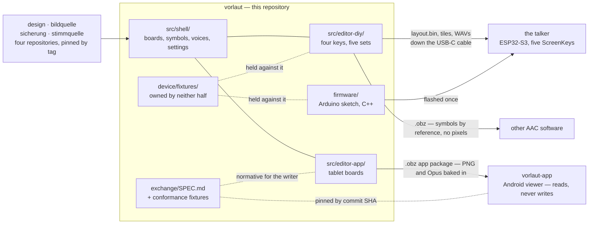

# The map: which repositories there are, and what passes between them

The reasoning for the layout of this project is all written down, and none of
it is in one place. Six documents each answer their own question and stop at
its edge; `README.md`'s *What it is made of* describes this repository's parts
and stops at this repository's edge. Nothing lets somebody see the shape.

This is the shape. Every claim here is a sentence and a link — the arguments
stay where they were made, because a summary that carries them drifts from them
within the week, and [`format-freeze.md` §9](format-freeze.md#9-prose-that-has-drifted-from-the-code)
is a list of exactly that happening.

---

## The rule that explains all of it

> A second **consumer** justifies extraction. A second **implementation**
> justifies a specification.

Two questions that sound like one and are not. *Used by more than one product*
is about **deployment**: it is why `design`, `bildquelle`, `sicherung` and
`stimmquelle` are four repositories of their own — another product needed them,
and it existed. *Has a second implementation that must agree* is about
**specification**: it is why [`exchange/SPEC.md`](../exchange/SPEC.md) and
[`device/`](../device/README.md) exist — two programs write and read the same
bytes, and neither of the two programs is the format.

The firmware meets the second test and fails the first. Nothing but this
builder writes `layout.bin` and nothing but this sketch reads it, so it has
never had a second consumer to leave for; but the format between them has two
implementations, and what that asks for is a written format with fixtures both
halves are held against, rather than a move. The distinction is in
[ADR 0006](../adr/0006-builder-and-hardware-one-repo.md)'s Why, and the working
out is [`obz-as-device-input.md` §12](obz-as-device-input.md).

Every boundary below is one of those two answers.

---

## The shape today

**Nothing proposed is drawn.** The diagram is what exists and runs today; the
proposals are prose, under [their own heading](#proposed-and-not-decided), so
that a reader skimming the picture cannot come away with a plan of record.

**Why mermaid, and not a picture or a table.** These files are read on
github.com — that is where `README.md`'s relative links land — and GitHub
renders a fenced `mermaid` block into a diagram there, with no build step and
nothing to keep in sync. It is also text: it diffs in a commit and moves in the
same edit as the sentence beside it, which neither a committed SVG nor a second
PNG beside `wiring.png` would. The cost is a reader in a plain editor, who gets
the source instead of the picture — a dozen labelled nodes and edges, which is
a table that happens to name its arrows.

---

## Decided, and proposed

The distinction that matters most on this page, so it is made before anything
else and repeated where each part is described.

| | |
|---|---|
| **Decided** | The Android app is a separate repository and a viewer only ([ADR 0004](../adr/0004-android-app-is-a-viewer.md)). The four shared packages are separate repositories ([`packages.md`](packages.md)). The package format is the app's boundary, specified and fixtured ([ADR 0005](../adr/0005-obf-obz-exchange-format.md), [`exchange/SPEC.md`](../exchange/SPEC.md)). The builder and the firmware share this repository ([ADR 0006](../adr/0006-builder-and-hardware-one-repo.md)). The device interface has fixtures owned by neither half ([ADR 0009](../adr/0009-device-interface-fixtures.md)). |
| **Proposed, nothing built** | A device-shaped `.obz` export, a device compiler shipped as a pinned package, and the firmware in a repository of its own ([`obz-as-device-input.md`](obz-as-device-input.md), [`device-interface.md`](device-interface.md)). |

---

## This repository

The board builder, the firmware, the enclosure, and the two formats that leave.
`README.md`'s *Working on it* has the module layout and the commands; what
matters for the map is that the browser side has **one shell and two authoring
halves**, and that they write to three different readers.

| | |
|---|---|
| [`src/shell/`](../src/shell/) | What any board builder needs, and neither editor owns: the list of boards, the symbol picker, the voices, the settings, import and export. |
| [`src/editor-diy/`](../src/editor-diy/) | The five-key talker, and only it — four slots to a set, five sets on the device, and the cable. |
| [`src/editor-app/`](../src/editor-app/) | The tablet boards the Android viewer renders — a grid, pages, a first column. |
| [`firmware/`](../firmware/) | The talker itself. C++, Arduino, ESP32-S3. |

What it writes, and who reads it:

| Artefact | Written by | Read by |
|---|---|---|
| `layout.bin`, the tiles and the 16 kHz WAVs | the build, pushed down the cable or into a folder | the firmware, on the device |
| An `.obz` board document, symbols **by reference** | [`src/data/obf.ts`](../src/data/obf.ts) | vorlaut itself, and other AAC software |
| An `.obz` app package, symbols and audio **baked in** | [`src/data/app_package.ts`](../src/data/app_package.ts) | `vorlaut-app` |
| A backup of everything, credentials and paths dropped | [`src/data/backup.ts`](../src/data/backup.ts), through `sicherung` | a folder the user picked, and whatever syncs it |

The two `.obz` doors are two functions that share no code path, and
[`exchange.md`](exchange.md) is why that is structural rather than tidy: the
first refuses to write a METACOM symbol as pixels at all, the second takes one
narrow step past that under [`SPEC.md`](../exchange/SPEC.md) §5.2, and one
function behind an argument would put the licence guarantee one call site away
from being untrue.

## `vorlaut-app`

[`Lautstark/vorlaut-app`](https://github.com/Lautstark/vorlaut-app) — Kotlin,
Android, the first non-TypeScript repository in the organisation. It opens a
package, shows the boards and speaks when a button is pressed.

**It does not edit and it does not export**, and that is load-bearing rather
than unfinished. [ADR 0004](../adr/0004-android-app-is-a-viewer.md) has the
argument; three of its consequences are what shape everything else on this
page. A viewer that cannot write cannot corrupt, so an import replaces a
package wholesale ([ADR 0007](../adr/0007-reimport-replaces-package-atomically.md))
and storage is a table of packages rather than a document database. One
direction means the format needs no round-trip property, so an importer may
discard what it does not understand and `SPEC.md` says so. And a package that
may not be redistributed is structurally safe on that device, because there is
no export path to disable.

## The four shared packages

Not on npm. Git dependencies pinned by release tag in `package.json`, built
through each package's own `prepare` script. [`packages.md`](packages.md) is
the whole story, including what each one is asked for and the one open bump.

| | |
|---|---|
| [`design`](https://github.com/Lautstark/design) | Tokens, `components.css`, the shared dark-mode handling — and `pins.js`, which every product already has because every product already depends on this. |
| [`bildquelle`](https://github.com/Lautstark/bildquelle) | ARASAAC and the user's own licensed METACOM folder behind one interface, plus the German pipeline that turns a typed sentence into words worth looking up. |
| [`sicherung`](https://github.com/Lautstark/sicherung) | The standing backup: a folder picked once, written to from then on. |
| [`stimmquelle`](https://github.com/Lautstark/stimmquelle) | The recording chain and the voice catalogue, with `shippable()` as the licensing gate. |

Two checks face in opposite directions and are easy to confuse. `pins.js` looks
**outward** — has any of the four published a newer tag? — and warns, never
fails. [`tools/installcheck.mjs`](../tools/installcheck.mjs) looks **inward**,
and is the one that holds the pin, the lockfile and the disk together: it
compares the tag in `package.json`, the version and commit in
`package-lock.json`, the commit in `node_modules/.package-lock.json` and the
version in each installed package's own `package.json`, names any package where
those four disagree, and stops. It runs ahead of all three suites, because the
way a stale install surfaces otherwise is a failure somewhere else with
plausible numbers in it. [`packages.md`](packages.md#installing-them) has the
measurement behind `npm ci`, and what installcheck can and cannot see.

---

## The seams

### Between the editor and the app: a specification

[`exchange/SPEC.md`](../exchange/SPEC.md) plus the conformance fixtures beside
it, in [`exchange/`](../exchange/README.md). Two programs implement a written
document and neither one is the document. The fixtures live with the **writer**
and the reader pins them, which works because one party can always be made to
move: the viewer gets an update. It is pinned by commit SHA rather than a tag,
because `exchange-v1.2.0` is not cut and will not be until a real board reaches
a tablet — [`format-freeze.md` §5](format-freeze.md#5-the-android-viewers-pin-and-which-half-a-device-freeze-solves)
is where that pin is examined, including the one normative rule that landed
after it with no version to show for it.

### Between the editor and the firmware: a folder, and a third thing

Today the boundary is a directory in one repository — `src/` on one side,
`firmware/` on the other — and the checks that hold them together compile the
sketch's own headers and replay the browser's actual bytes into the device's
actual reader. That is the argument in
[ADR 0006](../adr/0006-builder-and-hardware-one-repo.md) for why they have not
been separated, and [`device-interface.md`](device-interface.md#what-the-evidence-actually-says)
is the measurement that re-examined it and agreed.

Beside them sits [`device/`](../device/README.md), which belongs to neither.
Here the `exchange/` arrangement could not carry over, and
[ADR 0009](../adr/0009-device-interface-fixtures.md) says why in one sentence:
**neither party can be made to move.** A talker on a shelf in a house nobody in
this repository knows about is fixed by a person with a cable or not at all, so
a format the writer owns and the reader merely pins would put the authority on
the side with nothing at stake. Both halves are held against a third thing
instead. There is no prose specification there yet, deliberately — the fixtures
are the specification until the format holds still, and
[`format-freeze.md`](format-freeze.md#the-short-answer) is the list of what is
still moving.

### Proposed, and not decided

**Nothing in this section is built, and none of it is a plan of record.**

[`obz-as-device-input.md`](obz-as-device-input.md) weighs making the editor's
only output an `.obz`, with a device-side compiler that turns it into
`layout.bin` and the tiles, shipped as a package pinned the way the four above
are pinned. Its answer is that the premise holds — an `.obz` can carry
everything the device build uses — and that the move should **not** be made:
its recommendation 4 says not to package or split yet, because ADR 0006's
condition 2 is unmet and the format is still moving.

Three things follow, and it is worth keeping them apart:

- **The third export door** — a device-shaped `.obz` with the sources
  unresampled, negation as a flag and the device's own WAVs — is recommended on
  its own merits, independently of any split, and is the one part being built.
- **The compiler as a package** is the decision ADR 0006 refused. An ADR for it
  would **supersede** 0006 rather than amend it.
- **The firmware in its own repository** waits on evidence, and ADR 0006 says
  what counts as evidence and what does not.

---

## The wider family

A pointer rather than a chapter. Three other products in the same organisation
share the same four packages:
[`mitreden`](https://github.com/Lautstark/mitreden),
[`bildhaft`](https://github.com/Lautstark/bildhaft) and this one — which is
why a rule that exists twice is a rule that gets broken once, and why the
packages left in the first place. The shared conventions live in
[`conventions.md`](https://github.com/Lautstark/design/blob/main/docs/conventions.md)
in `Lautstark/design`, the same repository the tokens and `components.css` come
out of, and they are cited by paragraph rather than copied.

---

## Where the reasoning lives

Nothing above replaces these. Each one answers a question this page only names.

| | |
|---|---|
| [ADR 0004](../adr/0004-android-app-is-a-viewer.md) | Why the Android app imports and renders, and does not edit or export. |
| [ADR 0006](../adr/0006-builder-and-hardware-one-repo.md) | Why the builder and the firmware share a repository, and what would change that. |
| [ADR 0009](../adr/0009-device-interface-fixtures.md) | Why the device interface has fixtures of its own, owned by neither half. |
| [`device-interface.md`](device-interface.md) | What the interface actually consists of, measured, and whether the firmware can leave. |
| [`obz-as-device-input.md`](obz-as-device-input.md) | Whether the package could be the device build's input, and what it would cost. |
| [`format-freeze.md`](format-freeze.md) | What is still moving in the three formats, and what has to be true before a freeze. |
| [`exchange.md`](exchange.md) | The app package export: two doors rather than one, and why the licence makes that structural. |
| [`packages.md`](packages.md) | The four shared packages, how they are pinned, and what holds the pin honest. |
