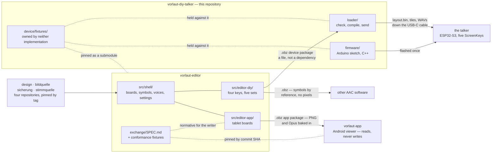

# The map: which repositories there are, and what passes between them

The reasoning for the layout of this project is all written down, and none of
it is in one place. Six documents each answer their own question and stop at
its edge; `README.md`'s *What it is made of* describes this repository's parts
and stops at this repository's edge. Nothing lets somebody see the shape.

This is the shape. Every claim here is a sentence and a link — the arguments
stay where they were made, because a summary that carries them drifts from them
within the week, and [`format-freeze.md` §9](format-freeze.md#9-prose-that-has-drifted-from-the-code)
is a list of exactly that happening.

---

## The rule that explains all of it

> A second **consumer** justifies extraction. A second **implementation**
> justifies a specification.

Two questions that sound like one and are not. *Used by more than one product*
is about **deployment**: it is why `design`, `bildquelle`, `sicherung` and
`stimmquelle` are four repositories of their own — another product needed them,
and it existed. *Has a second implementation that must agree* is about
**specification**: it is why [`exchange/SPEC.md`](https://github.com/Lautstark/vorlaut-editor/blob/main/exchange/SPEC.md) and
[`device/`](../device/README.md) exist — two programs write and read the same
bytes, and neither of the two programs is the format.

The firmware meets the second test and fails the first. Nothing but this
builder writes `layout.bin` and nothing but this sketch reads it, so it has
never had a second consumer to leave for; but the format between them has two
implementations, and what that asks for is a written format with fixtures both
halves are held against, rather than a move. The distinction is in
[ADR 0006](../adr/0006-builder-and-hardware-one-repo.md)'s Why, and the working
out is [`obz-as-device-input.md` §12](obz-as-device-input.md).

Every boundary below is one of those two answers.

---

## The shape today

**Nothing unbuilt is drawn.** The diagram is what exists and runs today, and
since 2026-08-27 that includes the split: the editor is its own repository, and
the two boxes are two repositories rather than two halves of one. What is still
prose under [its own heading](#the-split-and-the-route-it-replaced) is the third
name — the explainer site, which nobody has stood up.

**Why mermaid, and not a picture or a table.** These files are read on
github.com — that is where `README.md`'s relative links land — and GitHub
renders a fenced `mermaid` block into a diagram there, with no build step and
nothing to keep in sync. It is also text: it diffs in a commit and moves in the
same edit as the sentence beside it, which neither a committed SVG nor a second
PNG beside `wiring.png` would. The cost is a reader in a plain editor, who gets
the source instead of the picture — a dozen labelled nodes and edges, which is
a table that happens to name its arrows.

---

## Decided, and not built

The distinction that matters most on this page, so it is made before anything
else and repeated where each part is described. Since 2026-08-27 nothing on this
page is *proposed*: what is left of that column is a decision waiting to be
carried out, and two routes nobody is taking.

| | |
|---|---|
| **Decided** | The Android app is a separate repository and a viewer only ([ADR 0004](../adr/0004-android-app-is-a-viewer.md)). The four shared packages are separate repositories ([`packages.md`](packages.md)). The package format is the app's boundary, specified and fixtured ([ADR 0005](../adr/0005-obf-obz-exchange-format.md), [`exchange/SPEC.md`](https://github.com/Lautstark/vorlaut-editor/blob/main/exchange/SPEC.md)). The builder and the firmware share this repository ([ADR 0006](../adr/0006-builder-and-hardware-one-repo.md)). The device interface has fixtures owned by neither half ([ADR 0009](../adr/0009-device-interface-fixtures.md)). The device build has an `.obz` export of its own ([ADR 0010](../adr/0010-device-shaped-obz-export.md)). The editor exports a file and stops, and the talker's own repository compiles it and sends it ([ADR 0011](../adr/0011-editor-exports-the-talker-repository-sends.md)). This repository splits into three, and the **editor** is the half that leaves ([ADR 0012](../adr/0012-the-repository-splits-editor-leaves.md)); [what the pieces are called](#the-three-names) was settled ahead of it. |
| **Decided, nothing built** | The explainer site, `vorlaut`. It has been unblocked since the names were settled and is waiting on nobody. |
| **Decided and done** | The split. [ADR 0012](../adr/0012-the-repository-splits-editor-leaves.md) decided it on 2026-08-27 and it was carried out the same day: `vorlaut-editor` stands with a filtered history, and `src/` and `exchange/` are gone from here. [What it cost](#what-the-move-costs) was the checklist, and it is now the record. |
| **Not proposed by anybody** | ~~A device compiler shipped as a pinned package.~~ See [ADR 0011](../adr/0011-editor-exports-the-talker-repository-sends.md), and [`obz-as-device-input.md`](obz-as-device-input.md) for the route it replaced. ~~Splitting the **firmware** out~~ — the direction is the other one, and has been since the names were settled. |

---

## This repository

The firmware, the enclosure, the fixtures both ends are held against, and the
page that loads a board onto a talker. `README.md`'s *Working on it* has the
module layout and the commands; what matters for the map is that everything
here is on the **device** side of the file boundary — this repository reads the
format and writes what a talker holds, and authors nothing.

| | |
|---|---|
| [`loader/`](../loader/README.md) | The page: the checks, the compiler, the tile renderer, the `layout.bin` writer, the cable, and the reader half of the device package. Published at the root since the editor left. |
| [`firmware/`](../firmware/) | The talker itself. C++, Arduino, ESP32-S3. |
| [`device/`](../device/README.md) | The conformance fixtures, owned by neither implementation — [ADR 0009](../adr/0009-device-interface-fixtures.md). |
| [`case/`](../case/) | The enclosure, in OpenSCAD. |

## `vorlaut-editor`

[`Lautstark/vorlaut-editor`](https://github.com/Lautstark/vorlaut-editor) — the half that left on 2026-08-27, with a
filtered history in which `git blame` still reaches the commit that wrote each
line. It is the board builder: **one shell and two authoring halves**, writing
to three different readers.

| | |
|---|---|
| [`src/shell/`](https://github.com/Lautstark/vorlaut-editor/tree/main/src/shell/) | What any board builder needs, and neither editor owns: the list of boards, the symbol picker, the voices, the settings, import and export. |
| [`src/editor-diy/`](https://github.com/Lautstark/vorlaut-editor/tree/main/src/editor-diy/) | The five-key talker, and only it — four slots to a set, five sets on the device. |
| [`src/editor-app/`](https://github.com/Lautstark/vorlaut-editor/tree/main/src/editor-app/) | The tablet boards the Android viewer renders — a grid, pages, a first column. |

What it writes, and who reads it:

| Artefact | Written by | Read by |
|---|---|---|
| An `.obz` board document, symbols **by reference** | [`src/data/obf.ts`](https://github.com/Lautstark/vorlaut-editor/blob/main/src/data/obf.ts) | the editor itself, and other AAC software |
| An `.obz` app package, symbols and audio **baked in** | [`src/data/app_package.ts`](https://github.com/Lautstark/vorlaut-editor/blob/main/src/data/app_package.ts) | `vorlaut-app` |
| An `.obz` device package, sources unresampled and the device's own WAVs | [`src/data/device_package.ts`](https://github.com/Lautstark/vorlaut-editor/blob/main/src/data/device_package.ts) | [`loader/`](../loader/README.md) in this repository, which compiles it and sends it ([ADR 0010](../adr/0010-device-shaped-obz-export.md), [ADR 0011](../adr/0011-editor-exports-the-talker-repository-sends.md)) |
| A backup of everything, credentials and paths dropped | [`src/data/backup.ts`](https://github.com/Lautstark/vorlaut-editor/blob/main/src/data/backup.ts), through `sicherung` | a folder the user picked, and whatever syncs it |
| `layout.bin`, the tiles and the 16 kHz WAVs | **not the editor** — [`loader/`](../loader/README.md), out of the device package | the firmware, on the device |

The three `.obz` doors are three functions that share no code path, and
[`exchange.md`](exchange.md) is why that is structural rather than tidy: the
first refuses to write a METACOM symbol as pixels at all, the other two each
take one narrow step past that under [`SPEC.md`](https://github.com/Lautstark/vorlaut-editor/blob/main/exchange/SPEC.md) §5.2, and
one function behind an argument would put the licence guarantee one call site
away from being untrue.
[ADR 0010](../adr/0010-device-shaped-obz-export.md) is why the third one is a
door of its own rather than a flag on either of the first two.

**It pins this repository as a submodule**, at `third_party/vorlaut-diy-talker`,
for `device/fixtures/`. That is consumption and not ownership —
[ADR 0012](../adr/0012-the-repository-splits-editor-leaves.md)'s Why has the
argument — and the pin resolves across the split because this history was not
rewritten.

## `vorlaut-app`

[`Lautstark/vorlaut-app`](https://github.com/Lautstark/vorlaut-app) — Kotlin,
Android, the first non-TypeScript repository in the organisation. It opens a
package, shows the boards and speaks when a button is pressed.

**It does not edit and it does not export**, and that is load-bearing rather
than unfinished. [ADR 0004](../adr/0004-android-app-is-a-viewer.md) has the
argument; three of its consequences are what shape everything else on this
page. A viewer that cannot write cannot corrupt, so an import replaces a
package wholesale ([ADR 0007](../adr/0007-reimport-replaces-package-atomically.md))
and storage is a table of packages rather than a document database. One
direction means the format needs no round-trip property, so an importer may
discard what it does not understand and `SPEC.md` says so. And a package that
may not be redistributed is structurally safe on that device, because there is
no export path to disable.

## The four shared packages

Not on npm. Git dependencies pinned by release tag in `package.json`, built
through each package's own `prepare` script. [`packages.md`](packages.md) is
the whole story, including what each one is asked for and the one open bump.

| | |
|---|---|
| [`design`](https://github.com/Lautstark/design) | Tokens, `components.css`, the shared dark-mode handling — and `pins.js`, which every product already has because every product already depends on this. |
| [`bildquelle`](https://github.com/Lautstark/bildquelle) | ARASAAC and the user's own licensed METACOM folder behind one interface, plus the German pipeline that turns a typed sentence into words worth looking up. |
| [`sicherung`](https://github.com/Lautstark/sicherung) | The standing backup: a folder picked once, written to from then on. |
| [`stimmquelle`](https://github.com/Lautstark/stimmquelle) | The recording chain and the voice catalogue, with `shippable()` as the licensing gate. |

Two checks face in opposite directions and are easy to confuse. `pins.js` looks
**outward** — has any of the four published a newer tag? — and warns, never
fails. [`tools/installcheck.mjs`](../tools/installcheck.mjs) looks **inward**,
and is the one that holds the pin, the lockfile and the disk together: it
compares the tag in `package.json`, the version and commit in
`package-lock.json`, the commit in `node_modules/.package-lock.json` and the
version in each installed package's own `package.json`, names any package where
those four disagree, and stops. It runs ahead of all three suites, because the
way a stale install surfaces otherwise is a failure somewhere else with
plausible numbers in it. [`packages.md`](packages.md#installing-them) has the
measurement behind `npm ci`, and what installcheck can and cannot see.

---

## The seams

### Between the editor and the app: a specification

[`exchange/SPEC.md`](https://github.com/Lautstark/vorlaut-editor/blob/main/exchange/SPEC.md) plus the conformance fixtures beside
it, in [`exchange/`](https://github.com/Lautstark/vorlaut-editor/blob/main/exchange/README.md). Two programs implement a written
document and neither one is the document. The fixtures live with the **writer**
and the reader pins them, which works because one party can always be made to
move: the viewer gets an update. It is pinned by commit SHA rather than a tag,
because `exchange-v1.2.0` is not cut and will not be until a real board reaches
a tablet — [`format-freeze.md` §5](format-freeze.md#5-the-android-viewers-pin-and-which-half-a-device-freeze-solves)
is where that pin is examined, including the one normative rule that landed
after it with no version to show for it.

**Both of them are in `vorlaut-editor` now, and the viewer's pin points here.**
That is the one loose end the split left, and it is loose rather than broken.
`vorlaut-app` pins `exchange/` as a submodule of **this** repository, by commit
SHA; this history was not rewritten, so that SHA goes on resolving and the
existing pin is exactly as good as it was. What it cannot do is move: `exchange/`
is not in this repository's future commits, so a bump has nowhere to go, and
against the editor's filtered history the new ids are not translations of the old
— so re-pointing at `vorlaut-editor` is a **fresh pin**, not a bump.

Nothing has to happen today. The cheapest moment is when `exchange-v1.2.0` is
cut, which is what ends SHA-pinning anyway, and cutting it is `vorlaut-editor`'s
to do. Until then the sentence in that repository's `exchange/README.md` naming
`Lautstark/vorlaut-diy-talker` as the submodule URL is the stale one, and this
paragraph is where somebody arriving from `vorlaut-app` is meant to find that
out.

### Between the editor and the firmware: a folder, and a third thing

Today the boundary is a directory in one repository — `loader/` on one side,
`firmware/` on the other — and the checks that hold them together compile the
sketch's own headers and replay the browser's actual bytes into the device's
actual reader. That is the argument in
[ADR 0006](../adr/0006-builder-and-hardware-one-repo.md) for why they have not
been separated, and [`device-interface.md`](device-interface.md#what-the-evidence-actually-says)
is the measurement that re-examined it and agreed.

**The split does not cut here, and that is why it can happen at all.** The
editor's own boundary with the device is a file and has been since
[ADR 0011](../adr/0011-editor-exports-the-talker-repository-sends.md); the two
implementations of `layout.bin` are `loader/` and `firmware/`, and
[ADR 0012](../adr/0012-the-repository-splits-editor-leaves.md) leaves both of
them in this repository. The heading is the older shape and is kept because the
question is still asked in those words.

Beside them sits [`device/`](../device/README.md), which belongs to neither.
Here the `exchange/` arrangement could not carry over, and
[ADR 0009](../adr/0009-device-interface-fixtures.md) says why in one sentence:
**neither party can be made to move.** A talker on a shelf in a house nobody in
this repository knows about is fixed by a person with a cable or not at all, so
a format the writer owns and the reader merely pins would put the authority on
the side with nothing at stake. Both halves are held against a third thing
instead. There is no prose specification there yet, deliberately — the fixtures
are the specification until the format holds still, and
[`format-freeze.md`](format-freeze.md#the-short-answer) is the list of what is
still moving.

### The split, and the route it replaced

**Nothing in this section is proposed any more, and nothing in it is pending.**
The split was carried out on 2026-08-27. What is left beside it is the route
that was not taken — struck through rather than deleted, because it is what the
taken one had to beat.

~~[`obz-as-device-input.md`](obz-as-device-input.md) weighs making the editor's
only output an `.obz`, with a device-side compiler that turns it into
`layout.bin` and the tiles, shipped as a package pinned the way the four above
are pinned.~~ [`obz-as-device-input.md`](obz-as-device-input.md) established
that the premise holds — an `.obz` can carry everything the device build uses —
and that half of it stands. The package half does not.
[ADR 0011](../adr/0011-editor-exports-the-talker-repository-sends.md) replaced
it: **the editor exports a file and stops**, one action whatever kind of board
it is, and **the talker's own repository gains a page** that a person opens with
a talker in front of them — choose the file, validate it, compile it, connect,
send. There is no shared package and no cross-repo code dependency; the
boundary is the file format, full stop.

Three things follow, and it is worth keeping them apart:

- **The third export door** — a device-shaped `.obz` with the sources
  unresampled, negation as a flag and the device's own WAVs — was built on its
  own merits, independently of any split.
  [ADR 0010](../adr/0010-device-shaped-obz-export.md) records it. It is what
  makes the file boundary expressible at all.
- ~~**The compiler as a package** is the decision ADR 0006 refused. An ADR for it
  would **supersede** 0006 rather than amend it.~~ Still true of a package, and
  nobody is proposing one. ADR 0011 puts the compiler in the repository the
  firmware is already in, so both implementations of every device format stay on
  one side and 0006 is **amended** rather than superseded — its revisit
  condition 2 lost its premise rather than its force.
- ~~**Splitting this repository** waits on evidence, and ADR 0006 says what
  counts as evidence and what does not.~~ **Decided on 2026-08-27:**
  [ADR 0012](../adr/0012-the-repository-splits-editor-leaves.md). Which half
  moves was never the open part — it is the editor. What was open was
  *whether*, and the two reasons for waiting both dissolved: ADR 0006's
  condition 2 turned out to gate a package nobody is building, and
  [`format-freeze.md`](format-freeze.md#the-short-answer) now records the three
  items that had to land before a device freeze as landed. ADR 0012 claims no
  evidence it does not have — none of 0006's four conditions fired — and argues
  instead that ADR 0011 moved the seam off the thing 0006 protects. Nothing has
  moved yet; the section below stops being a prediction and becomes the
  checklist.

#### The three names

**The names were settled before the split was**, on purpose: cheap to settle
early, expensive to settle halfway through a move. They are unchanged by the
decision, and [ADR 0012](../adr/0012-the-repository-splits-editor-leaves.md)
adopts them as written.

| | |
|---|---|
| `vorlaut-diy-talker` | **This repository**, keeping its name, its history, its address and its `v*` tags. It becomes the device: [`firmware/`](../firmware/), [`case/`](../case/), [`device/`](../device/README.md), [`loader/`](../loader/README.md) — the page that compiles an exported file into what the talker reads and sends it down the cable — and `tests/run.py` with the Python beside it. |
| `vorlaut-editor` | New. The editor leaves — [`src/shell/`](https://github.com/Lautstark/vorlaut-editor/tree/main/src/shell/), [`src/editor-diy/`](https://github.com/Lautstark/vorlaut-editor/tree/main/src/editor-diy/), [`src/editor-app/`](https://github.com/Lautstark/vorlaut-editor/tree/main/src/editor-app/), the three `.obz` doors, [`exchange/`](https://github.com/Lautstark/vorlaut-editor/blob/main/exchange/README.md) and `tests/reference/`. |
| `vorlaut` | New. A GitHub Pages site explaining the three products — the Android app, the editor, the DIY talker — to a reader who is not a developer. |

**The three names are unchanged by
[ADR 0011](../adr/0011-editor-exports-the-talker-repository-sends.md) and by
[ADR 0012](../adr/0012-the-repository-splits-editor-leaves.md), and one of them
stopped being vague.** *"Whatever compiles a package into what the
talker reads"* was a placeholder for something undecided when this table was
written; it is now a page, and it is being built here rather than waiting for a
split. Two consequences worth having in front of the names. This repository's
Pages deployment starts carrying two things rather than one — the editor and
the talker's page — so the split is not the moment a second site has to be
stood up, it is the moment the editor's build moves out and the talker's page
stays where it already was. And what leaves with the editor is three writer
functions rather than two: the talker document, the app package and the device
package ([ADR 0010](../adr/0010-device-shaped-obz-export.md)), all three of
them files and none of them a cable.

**The direction is the opposite of the one the rest of this page assumes.**
Every sentence above about the firmware moving into a repository of its own
describes the same split with the other half moving: the editor leaves, the
device stays. The repository is named for the talker, and the talker keeps it.

**The third name is not waiting for any of this.** `vorlaut` — the explainer
site — reads no format, writes no format, pins nothing and is pinned by
nothing. It could exist today, and none of what follows applies to it. The
three names are one decision and not one event, and reading them as one event
defers the only piece that is unblocked. ADR 0012 decides the other two and says
so again: `vorlaut` is not waiting for them either.

##### What `docs/` still says about the editor

**Several documents here describe code that is now in `vorlaut-editor`, and
they were left as they were.** Naming them is more useful than rewriting them,
because most are dated analyses whose value is what was true when they were
written — a rewrite would make them agree with today and stop being evidence of
anything.

| | |
|---|---|
| [`exchange.md`](exchange.md), [`negation.md`](negation.md), [`symbol-search.md`](symbol-search.md), [`sammlung-settings.md`](sammlung-settings.md), [`schema-upgrades.md`](schema-upgrades.md), [`browser-tts.md`](browser-tts.md) | About the editor's features, and the editor's alone. They belong in that repository and have not been moved there; nothing in this one implements what they describe. |
| [`split-crossings.md`](split-crossings.md), [`split-rehearsal.md`](split-rehearsal.md), [`obz-as-device-input.md`](obz-as-device-input.md), [`format-freeze.md`](format-freeze.md) | Measurements taken before the move, and correct as of their dates. They describe `src/` in the present tense because it was present when they were written. |
| [`frozen-references.md`](frozen-references.md), [`packages.md`](packages.md), [`languages.md`](languages.md), [`device-interface.md`](device-interface.md) | Half each. The parts about the locks, the pins and the formats this repository still holds are live; the parts about `obf.lock.json`, `tts.lock.json`, `symbols.lock.json` and the three packages that left are not. |

Every **link** in all of them resolves — the ones into the editor were rewritten
to point across on the day, and `tests/test_links.py` is what holds that. What
was not rewritten is the prose around the links, and
[`format-freeze.md` §9](format-freeze.md#9-prose-that-has-drifted-from-the-code)
is the standing lesson about exactly this: reading catches the citation at the
top of a file and misses the one two hundred lines down.

One file is deliberately untouched and must stay that way:
[`device/tools/make_fixtures.mjs`](../device/tools/make_fixtures.mjs) names
`src/data/obf.ts`, `src/data/zip.ts` and `src/backend/cable.ts` inside strings
that are **written into the committed fixtures**. Editing them would make the
generator disagree with its own frozen output, which
[`frozen-references.md`](frozen-references.md) is the document about.

##### What the move costs

Worked out while it was cheap, and it stopped being hypothetical on 2026-08-27.
**It was then worked through, the same day, and every paragraph below held.**
This was the checklist; it is now the record, and each paragraph is a thing that
was answered rather than discovered —
[ADR 0012](../adr/0012-the-repository-splits-editor-leaves.md) points here for
exactly that. Two things the reading did not catch are noted where they belong:
the loader page's e2e was built on the editor's writer and now reads committed
fixtures ([`e2e/fixtures/packages/README.md`](../e2e/fixtures/packages/README.md)),
and `device_fixtures.test.ts`'s one claim about `normalizeLayout()` was the
editor's to make and went with it.

**The history goes with the device, and the editor should get a rewritten copy
rather than an empty one.** The reasoning in this project is largely in its
commit messages, and the way anybody actually reaches it is `git blame` on the
line in front of them — a pointer to another repository is not something blame
can follow, and an editor starting empty answers "initial import" for every
line of `src/` for ever. The usual objection to `git filter-repo`, that it
rewrites ids other people have pinned, does not apply here: the rewrite is on
the **copy**. This repository is not touched, so every SHA already cited — the
Android viewer's pin among them — keeps resolving exactly where it did. Two
costs to state rather than discover. The same commit then exists twice under
two ids, and the device repository stays the one that is cited. And a
path-filtered commit keeps its whole message while keeping half its diff:
[ADR 0006](../adr/0006-builder-and-hardware-one-repo.md#consequences) calls the
mixed history mostly a feature, because the commit that changed the format is
next to the commit that changed the reader, and this is where that bill
arrives. The editor's history would be for reading, not for auditing.

**Pages moves, and the base path moves with it.**
[`pages.yml`](../.github/workflows/pages.yml) builds with
`BASE_PATH: /${{ github.event.repository.name }}/`, so the workflow follows a
rename for free — it is not where this bites. The base is also written out
**literally** in three tracked places, and those do not follow anything:
[`package.json`](../package.json)'s `test:e2e` and `build:pages`, and
[`playwright.config.ts`](../playwright.config.ts)'s `BASE`. Beside them,
[`src/backend/local.ts`](https://github.com/Lautstark/vorlaut-editor/blob/main/src/backend/local.ts) passes `piperRuntime()`'s
`base` explicitly because the package cannot default it —
[`packages.md`](packages.md) has that whole edge, and both of its failure modes
are silent: a build with no base renders an empty body with no error at all,
and a wrong base fetches the phonemizer from a prefix that 404s on the first
spoken sentence, which e2e cannot see because it stands that chunk in. The
published address changes too, from
`https://lautstark.github.io/vorlaut-diy-talker/` to `/vorlaut-editor/`, and a
project site that changes repository leaves no redirect behind it. `README.md`
names the old one, and so does every bookmark a caregiver made. The explainer
site is the answer to that if it exists first — one address that outlives
whichever repository serves the editor. After
[ADR 0011](../adr/0011-editor-exports-the-talker-repository-sends.md) the bill
is smaller than that paragraph assumes, and it is worth knowing which half
pays: the **editor's** address changes repository and the talker page's does
not. Its path does change, and that is the correction to carry into the move —
the page moves up from `<base>loader/` to `<base>`, because once the editor is
gone it is this site's only page and takes the root. Nothing is bookmarked
either way yet, the loader page being days old, so what that costs is this
sentence rather than a broken link. What was load-bearing survives: the address
somebody eventually opens with a cable in their hand is served from the
repository that keeps its name, and no rename sits underneath it.

**The loader becomes the root entry point, and that is the whole of the
answer.** [`vite.config.ts`](../vite.config.ts)'s `rollupOptions.input` names
one page rather than two afterwards, and the page has to sit at the repository
root for Vite to emit it there — an input is emitted at its own path, so naming
`loader/index.html` alone would go on publishing `<base>loader/`. That block's
long comment, about a second entry point that is never named and 404s in
silence, is worth leaving intact for whoever makes the edit. The three literal
base paths above need no edit at all: `/vorlaut-diy-talker/` is still the base,
because it is the repository name that is unchanged rather than the path.

**`v*` keeps meaning a firmware release, and that is the naming's clearest
win.** [ADR 0006](../adr/0006-builder-and-hardware-one-repo.md#consequences)
records `v*` as a firmware release, built and annotated by `release.yml`, and
warns that a second releasable thing here would need its own prefix rather than
its own meaning for `v*`. The device keeping this repository keeps
`release.yml`, the published tags and the notes as they stand: nothing is
re-prefixed, and no tag already out in the world changes meaning. The editor
arrives at an empty tag namespace and may spend `v*` on itself. The other
direction would have moved the release scheme out of the repository that
published the tags, which is the expensive half of that trade.

**`exchange/` goes with the editor, and its rule still reads correctly.**
[`exchange/README.md`](https://github.com/Lautstark/vorlaut-editor/blob/main/exchange/README.md) puts the fixtures with the
**writer** and has the reader pin them, and says why it works: one party can
always be made to move, because the viewer gets an update. The writer is
[`src/data/app_package.ts`](https://github.com/Lautstark/vorlaut-editor/blob/main/src/data/app_package.ts), which is the editor's,
and the reader is the Android app, which is nobody's here. Both halves of that
sentence survive the move unchanged, and the fixtures end up in the repository
whose code they describe — a small improvement on today. Two things to do on
the day rather than find out afterwards. That README's pinning instructions
name `Lautstark/vorlaut-diy-talker` as the submodule URL, and the viewer's pin
is a commit SHA into it; neither breaks, since this history is not rewritten,
but the pin **freezes** — the viewer cannot move forward without re-pointing at
`vorlaut-editor`, and against a filtered copy the new ids are not translations
of the old, so it is a fresh pin and not a bump. The cheapest moment is when
`exchange-v1.2.0` is finally cut, which is the thing that ends SHA-pinning
anyway
([`format-freeze.md` §5](format-freeze.md#5-the-android-viewers-pin-and-which-half-a-device-freeze-solves)).
The rule also does not stretch: should the device build ever read an `.obz`,
the device becomes a reader of a format whose fixtures live with the writer,
and the device is exactly the party
[ADR 0009](../adr/0009-device-interface-fixtures.md) says cannot be made to
move. That arrangement covers the app and does not cover the talker.

**`device/fixtures/` was the one thing the naming made worse, and it is
settled: the fixtures stay in `vorlaut-diy-talker`, and no fourth name is
needed.**
[`format-freeze.md` §6](format-freeze.md#6-testsreference-and-devicefixtures--the-boundary-is-real)
establishes that the two directories do not overlap and that `tests/reference/`
protects `src/` and goes with the editor. It also said `device/fixtures/`
"becomes the third repository", which was written when the third repository was
going to be the device format's; under these names the third one is the
explainer site, and there is no spare name. That sentence is now corrected in
place rather than reinterpreted.

~~The fixtures either sit in `vorlaut-diy-talker`, where one of the two halves
owns them and [ADR 0009](../adr/0009-device-interface-fixtures.md)'s whole point
is that neither should, or a fourth name is needed.~~ **That dilemma had a
premise that ADR 0011 removed**, and
[ADR 0012](../adr/0012-the-repository-splits-editor-leaves.md) adopts the answer.
ADR 0009's concern is an asymmetry with a specific shape: a format whose
fixtures live with the *writer* while the *reader* merely pins them puts the
authority on the side with nothing at stake, and the reader here is a talker on
a shelf that nobody can make move. After ADR 0011 the writer
([`loader/src/layout_format.ts`](../loader/src/layout_format.ts)) and the reader
([`firmware/`](../firmware/)) are **both** in `vorlaut-diy-talker`, and the
editor is not a party to the device format at all — it takes ten read-only names
out of `loader/`, calls `renderLayoutBin()` never, and writes no `layout.bin`.
So the fixtures sitting there does not put them with one of two halves; it puts
them with both, which is the arrangement they have today and the one ADR 0009
asked for. The ownership statement that matters is about a directory belonging
to neither `loader/` nor `firmware/`, and the split does not touch it, because
the split does not separate those two. A fourth repository would add a pin, a
tag and a version boundary to buy a property the directory already has.

`tests/reference/` still does not move as a unit. The locks divide the same way
and no more neatly:
`obf.lock.json` and `tts.lock.json` follow the converter and the recording
chain to the editor, `layout.lock.json` follows the writer it protects to the
device, and `tiles.lock.json` is awkward because the module under it is.
[`loader/src/tiles.ts`](../loader/src/tiles.ts) is not on one side — `renderSymbol()`
belongs to the device build, while `thumbnailSize()` is imported by
[`src/data/app_assets.ts`](https://github.com/Lautstark/vorlaut-editor/blob/main/src/data/app_assets.ts) for the app package's
images, and the only reason that function is worth having is that it follows
Pillow's rounding step for step. Split the module and that rounding rule exists
twice with nothing holding the copies together, which is the failure
[`frozen-references.md`](frozen-references.md) exists to record.

**`tests/run.py` stays here whole, and that is the naming's other win.** It
compiles `firmware/vorlaut/*.h` and replays the browser's actual bytes into the
device's actual reader, and
[ADR 0006](../adr/0006-builder-and-hardware-one-repo.md)'s Why is that only one
repository can hold two implementations against each other. Under this
direction both implementations land in `vorlaut-diy-talker`: the C++ reader,
and the TypeScript writer, because the writer is the compiler and the compiler
goes with the device. That was a prediction when it was written and
[ADR 0011](../adr/0011-editor-exports-the-talker-repository-sends.md) makes it
a fact, before any repository moves: the compiler is the page, and the page is
the device's. `test_layout_frozen.py`, `test_cable_format.py`,
`test_texts.py`, `test_device_host.py` and `test_device_fixtures.py` all stay
beside the thing they compile. This was the reason the direction was chosen and
it is now the reason the split is safe:
[ADR 0012](../adr/0012-the-repository-splits-editor-leaves.md) claims no
evidence under ADR 0006's four conditions and does not need any, because the cut
does not run through what 0006 protects. The editor takes
`test_exchange_fixtures.py`, which travels with `exchange/`, and **a copy** of
`test_links.py` and `test_language.py` — ~~keeps~~, because a rehearsal found
both are needed by *both* halves rather than kept by one.
[`split-rehearsal.md` §5](split-rehearsal.md#5-the-python-division-as-written-is-wrong)
has the finding: `test_language.py` allowlists `firmware/vorlaut/texts.h` as a
file permitted to hold German, so a talker keeping `firmware/` with no copy
loses the rule over the files it was written for, and `test_links.py` checks
prose the talker keeps most of, since `adr/` and `docs/` go there.
`test_texts.py` is the talker's outright, not the editor's, for the same kind of
reason. None of the editor's needs a compiler: ADR 0006's three-toolchain
consequence unwinds for the editor and stands for the device.

**The seam the names describe is ~~not a directory yet~~ being made one, and
that is the whole of what changed.** "Whatever compiles a package into what the
talker reads" was `runBuild()`, at the foot of
[`src/backend/local.ts`](https://github.com/Lautstark/vorlaut-editor/blob/main/src/backend/local.ts) — the same file that answers
the editor's questions, as its own opening comment says. The move is cheap
exactly when that boundary is a file format rather than a function call, and
the device-shaped `.obz` in the first bullet above is what makes it one: the
editor writes a package, the device's page compiles it, and the two are held
apart by fixtures instead of by an import.
[ADR 0011](../adr/0011-editor-exports-the-talker-repository-sends.md) is the
decision to do that, and it was done before the split rather than during it —
which is why [ADR 0012](../adr/0012-the-repository-splits-editor-leaves.md) is a
directory moving out of a repository rather than a boundary invented under time
pressure. Still not a reason to hurry: a decided move with no date on it is what
this whole section is for.

---

## The wider family

A pointer rather than a chapter. Three other products in the same organisation
share the same four packages:
[`mitreden`](https://github.com/Lautstark/mitreden),
[`bildhaft`](https://github.com/Lautstark/bildhaft) and this one — which is
why a rule that exists twice is a rule that gets broken once, and why the
packages left in the first place. The shared conventions live in
[`conventions.md`](https://github.com/Lautstark/design/blob/main/docs/conventions.md)
in `Lautstark/design`, the same repository the tokens and `components.css` come
out of, and they are cited by paragraph rather than copied.

---

## Where the reasoning lives

Nothing above replaces these. Each one answers a question this page only names.

| | |
|---|---|
| [ADR 0004](../adr/0004-android-app-is-a-viewer.md) | Why the Android app imports and renders, and does not edit or export. |
| [ADR 0006](../adr/0006-builder-and-hardware-one-repo.md) | Why the builder and the firmware share a repository, and what would change that. |
| [ADR 0009](../adr/0009-device-interface-fixtures.md) | Why the device interface has fixtures of its own, owned by neither half. |
| [`device-interface.md`](device-interface.md) | What the interface actually consists of, measured. Its split question was asked with the direction reversed; read its status line first. |
| [ADR 0010](../adr/0010-device-shaped-obz-export.md) | Why the device build has an `.obz` export of its own, and why it is a third door. |
| [ADR 0011](../adr/0011-editor-exports-the-talker-repository-sends.md) | Why the editor exports a file and stops, and why the page that sends it is the talker's. |
| [ADR 0012](../adr/0012-the-repository-splits-editor-leaves.md) | Why this repository splits into three, why the editor is the half that leaves, and why 0006 is not superseded. |
| [`obz-as-device-input.md`](obz-as-device-input.md) | Whether the package could be the device build's input — yes — and what a compiler package would have cost. Half superseded; read its status line first. |
| [`format-freeze.md`](format-freeze.md) | What is still moving in the three formats, and what has to be true before a freeze. |
| [`exchange.md`](exchange.md) | The app package export: two doors rather than one, and why the licence makes that structural. |
| [`packages.md`](packages.md) | The four shared packages, how they are pinned, and what holds the pin honest. |
